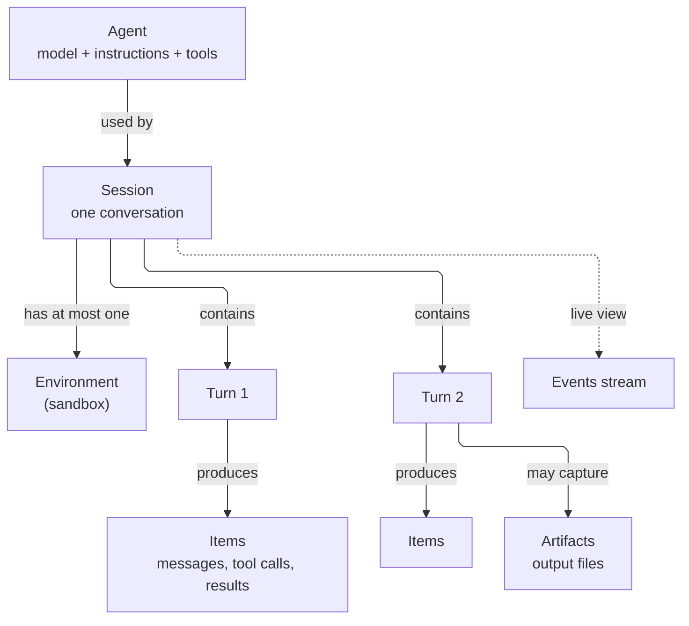
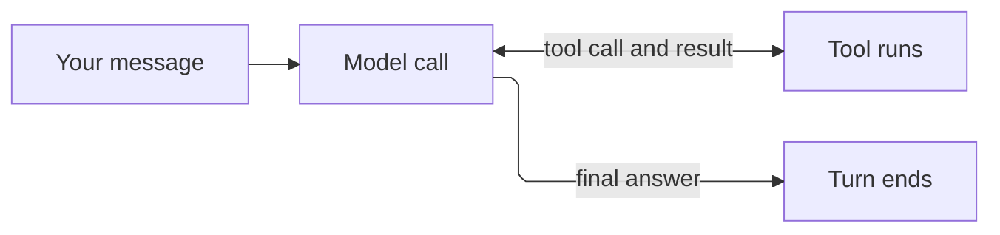

Orca has a small number of building blocks. Once you know what each one is for and how they connect, every guide in these docs follows the same pattern.



## Agent: what the AI is

An **agent** is a saved configuration. It says which model to use, what instructions to follow, and which tools the model may call. Creating an agent does not run anything or call the model.

Create an agent once and reuse it for many conversations. Each session copies the agent's settings when it is created, so if you edit the agent later, only sessions created after the edit use the new settings.

```python
agent = client.beta.agents.create(
    model="orca/openrouter/YOUR_OPENROUTER_MODEL_ID",
    name="support-bot",
    instructions="Answer billing questions. Be brief.",
)
```

## Session: one conversation

A **session** is one conversation with an agent. It remembers everything said so far, so a follow-up message can refer to earlier ones. A session also decides:

- **Whether the agent gets a sandbox**, through its `environment`. A sandbox is called an environment in the API.
- **Which stored credentials the agent's tools may use**, through `vault_ids`.

You usually create one session per chat thread, ticket, or job. Keep the session ID to continue the conversation later. An agent ID is not a conversation; two sessions on the same agent share nothing except settings.

```python
session = client.beta.agents.sessions.create(
    agent_id=agent.id,
    environment={"type": "none"},   # no sandbox; see "Environment" below
    input="Why was I charged twice?",  # optional: starts the first turn now
)
```

## Turn: one round of work

A **turn** is everything the agent does in response to one message. Inside a turn, the agent may call the model several times, run tools, read results, and call the model again, until it has a final answer. You do not drive this loop; Orca does.



Every turn ends in one of three ways: `completed`, `failed`, or `cancelled`. A session can contain many turns, one after another. Only one turn runs at a time.

Creating a session or sending a message returns **immediately**, before the turn finishes. Your request was accepted, nothing more. To know the outcome, wait for the turn to end: either [stream events](/guides/streaming) or poll the turn list. [Turns and statuses](/turn-lifecycle) covers this in detail; it is the most common source of confusion for new users.

## Items: the saved history

An **item** is one entry in the conversation history. The history is not only chat messages; it records everything the agent did:

| Item `type` | What it records |
| --- | --- |
| `message` | A message from the user or the assistant. Text lives in `content`. |
| `reasoning` | The model's reasoning step, when the model produces one. |
| `function_call` / `function_call_output` | A call to one of your function tools, and the result you returned. |
| `mcp_call` | A call to a remote MCP tool, with its result. |
| `command_execution` | A shell command run in the sandbox, with its output. |
| `web_search_call` | A web search, when that tool is enabled. |
| `create_subagent_call` and other subagent calls | The agent handing work to a [subagent](/guides/subagents). |

Read items with `sessions.items.list(session_id)`. The list is paginated and newest first.

## Events: the live view

**Events** are the same activity, delivered as it happens over a server-sent events (SSE) stream: text as it is generated, items as they are added, and status changes. Use events to show progress in a UI. Use items and turns when you need the saved record.

Events also go the other way: you send a follow-up message, a tool result, or a cancel request by posting an **input event** to the session. See [streaming and cancellation](/guides/streaming).

## Environment: the sandbox

An **environment** is the machine where the agent runs shell commands and reads and writes files. Every session picks one of three types when it is created:

| `environment.type` | What the agent gets | Use it for |
| --- | --- | --- |
| `none` | No machine. The agent can still talk, call your function tools, and call MCP tools. | Chat, Q&A, and workflows where your application does the work |
| `openai_hosted` | A managed sandbox that Orca creates for this session and deletes with it. Despite the name, it runs on your Orca deployment, not at OpenAI. | Running code, analyzing files, producing reports |
| `self_hosted` | A machine you run yourself, which connects to Orca. Coming soon on hosted Orca. | Working against your own files, network, or hardware |

Each session has its own environment; sessions never share one. See [execution environments](/guides/environments).

## Artifacts: files the agent produced

When a turn completes, Orca collects every file the agent wrote under the `outputs` folder of its workspace (`/workspace/outputs` in a managed sandbox) and saves a copy as an **artifact**. Artifacts are snapshots: if the agent changes the file in a later turn, the earlier artifact stays the same, and the later turn gets its own.

Download artifacts before you delete the session. Deleting a session deletes its artifacts. See [files and artifacts](/guides/files-and-artifacts).

## Where each piece runs

This matters for security and debugging, because it tells you which machine makes each network request.

| Activity | Runs on | Notes |
| --- | --- | --- |
| The agent loop and model calls | Orca server | You never call the model directly. |
| [Function tools](/guides/function-tools) | **Your application** | Orca pauses the turn and waits for your answer. |
| [MCP tools](/guides/mcp) | Orca server, calling the remote MCP server | The MCP server must be approved by your Orca administrator. Can be switched to connect from the sandbox. |
| Shell commands, file edits, code | The session's sandbox | Only if the session has an environment. |
| [Subagents](/guides/subagents) | Same as the parent | Share the parent's sandbox and tools. |

## Supporting resources

These are created separately and then attached to agents or sessions:

| Resource | What it is | Attach it to |
| --- | --- | --- |
| **File** | An uploaded file, stored once and reusable | A sandbox, by copying it into the workspace at session start |
| **Skill** | A versioned folder of instructions (and optional scripts) for a specific task | A sandbox, through the session's `environment` or a template |
| **Environment template** | A reusable sandbox recipe: files, skills, network policy | A session's `environment` |
| **Vault** | A locked box of credentials for MCP servers. The agent can use them but never read them. | A session's `vault_ids` |
| **Provider key** | Your own key for a model provider, such as Anthropic or OpenRouter | Your account; select it through the agent's `model` |

## What you are responsible for

- **Waiting for the real outcome.** An accepted request is not a finished turn. See [turns and statuses](/turn-lifecycle).
- **Answering function calls.** If your agent has function tools, your application must return results or the turn waits.
- **Deciding what is safe.** Tool arguments come from the model. Validate them in your code; do not rely on instructions to prevent dangerous actions.
- **Cleaning up.** Delete sessions you no longer need. This releases their sandbox. Agents, files, skills, templates, and vaults are deleted separately.

## Next

<CardGroup cols={2}>
  <Card title="Turns and statuses" icon="arrows-spin" href="/turn-lifecycle">How to tell when work is done, and what to do when it is not.</Card>
  <Card title="Quickstart" icon="terminal" href="/quickstart">See every piece in one short program.</Card>
</CardGroup>
