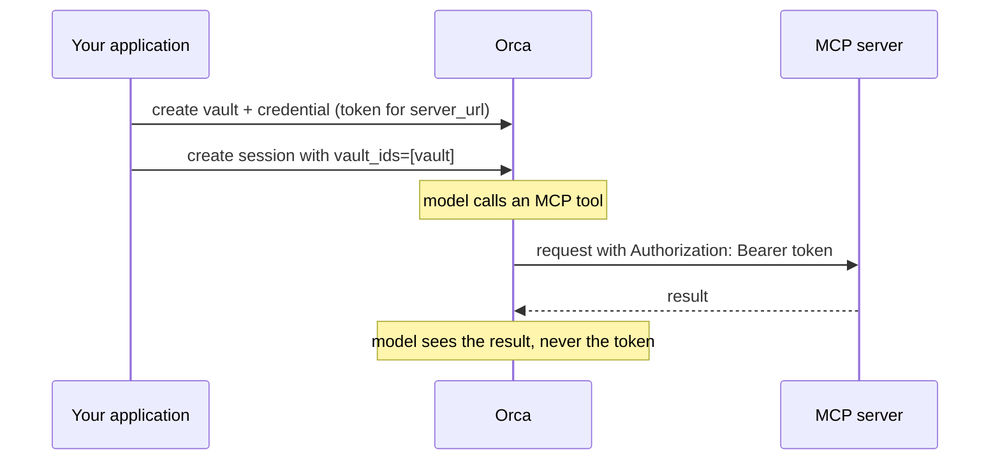

Your agent may need to log in to the services it uses, for example an MCP server that requires a bearer token. You should never put such a token in instructions, messages, or files: anything the model can read, it can repeat. Vaults solve this.

A **vault** is a container for **credentials**. Each credential is a token for one exact MCP server URL. When you attach a vault to a session, Orca adds the matching token to requests it sends to that server. The model never sees the token, and the API never returns it once stored.

Creating, rotating, and deleting vaults and credentials needs the [admin role](/organizations#roles). Any member can attach a vault to a session.

<Note>
Remote MCP servers are currently blocked on hosted Orca, so credentials for them are not used yet. See [MCP tools](/guides/mcp). If you need a remote MCP server, write to support@okik.io.
</Note>

## Three kinds of keys

New users often mix these up. They are separate and not interchangeable:

| Key | What it unlocks | Where it goes |
| --- | --- | --- |
| **Orca API key** | Your account on the Orca endpoint | Your application's client configuration |
| **Provider key** | A model provider account (OpenAI, Anthropic, ...) for your agents' models | Orca's provider settings; see [models and provider keys](/providers) |
| **Vault credential** | One MCP server | A vault attached to the session |

## How it works



## Create, use, rotate, and delete

Examples on this page assume `client` is an `OpenAI` client configured as in the [quickstart](/quickstart).

```python
import os

vaults = client.beta.agents.vaults
url = "https://mcp.example.com/orders/mcp"

# 1. Create a vault and store the MCP server's token in it.
vault = vaults.create(name="orders")
credential = vaults.credentials.create(
    vault.id,
    name="read-orders",
    auth={
        "type": "static_bearer",
        "mcp_server_url": url,
        "token": os.environ["ORDERS_MCP_TOKEN"],
    },
)

# 2. Attach it when you create a session:
#    client.beta.agents.sessions.create(..., vault_ids=[vault.id])

# 3. Rotate the token later. You never need to read the old one.
vaults.credentials.update(
    credential.id,
    vault_id=vault.id,
    auth={"type": "static_bearer", "token": os.environ["NEW_ORDERS_MCP_TOKEN"]},
)

# 4. Delete them once no session needs them.
vaults.credentials.delete(credential.id, vault_id=vault.id)
vaults.delete(vault.id)
```

- **`mcp_server_url`** must be HTTPS and must match the MCP tool's `server_url` exactly.
- **Attach** the vault with `vault_ids=[vault.id]` when you create the session. Attach only the vaults that session needs.
- **Rotate** by sending a new token with `credentials.update`. You never need to read the old one, and you cannot.
- **Responses never include the token.** Keep your own copy in your secret manager if you need it again.

## Credential types

| `auth.type` | Use it when |
| --- | --- |
| `static_bearer` | The server accepts a fixed token. Orca sends it as a bearer token. |
| `mcp_oauth` | The server uses OAuth. You provide an `access_token`, its `expires_at`, and optionally `refresh` details (refresh token and token endpoint), and Orca refreshes the access token when it expires. |

## What can go wrong

- **No matching credential.** If a tool needs a credential and no attached vault has one for that exact URL, session creation fails. Check for differences in path or a trailing slash.
- **Token rejected by the server.** Rotate the credential. Sessions created afterwards use the new token.
- **Destination not enabled.** Remote MCP servers are currently blocked on hosted Orca. A credential does not change that.
- **HTTP 403 `permission_denied`.** Writing vaults and credentials needs the admin role.

## Keep it safe

- Never put tokens in prompts, function results, skills, staged files, sandbox `env`, or logs.
- Use the narrowest token the service offers (read-only where possible), and pair it with `allowed_tools` on the agent. See [MCP tools](/guides/mcp).
- Protect your Orca API key. Anyone holding it can create sessions that use your vaults.

See also: [MCP tools](/guides/mcp), [runnable examples](/examples), and the [vault reference](/reference/resources#vaults-and-credentials).
