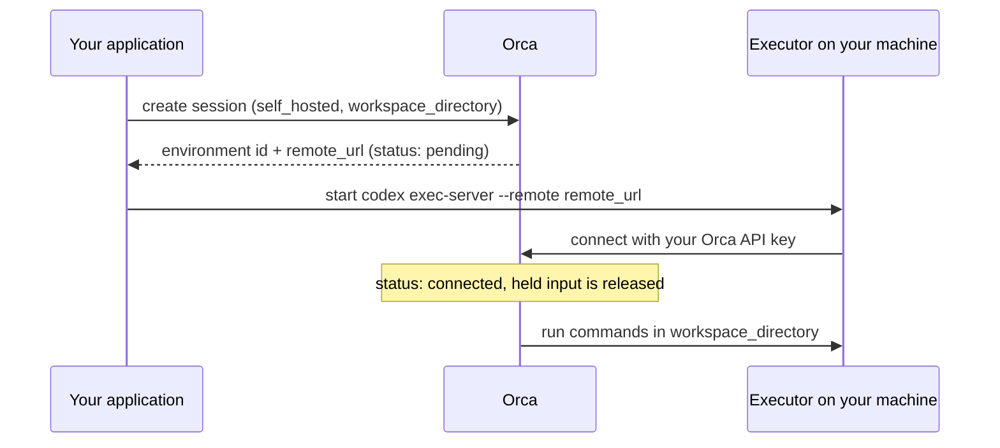

An **environment** is a computer the agent can use: it runs shell commands, reads and writes files, and executes code there. Without one, the agent can only talk and call tools. You choose the environment when you create a session, and it stays with that session until the session is deleted.

## Pick a type

| | `none` | `openai_hosted` (managed) | `self_hosted` (coming soon on hosted Orca) |
| --- | --- | --- | --- |
| **What it is** | No machine | A fresh, isolated container that Orca creates for the session | A machine you run, connected to Orca by a small program |
| **Agent can run commands** | No | Yes | Yes |
| **Who runs it** | Nobody | Orca | You |
| **Starts with** | Nothing | An empty `/workspace`, plus files and skills you stage | Whatever is in the folder you choose |
| **Deleted with the session** | n/a | Yes | No. Orca disconnects; your machine and files remain. |
| **Use it for** | Chat, Q&A, tool-only agents | Data analysis, code tasks, generating reports | Working on your own repositories, data, or private network |

<Note>
`openai_hosted` is the name the Agents API uses for a managed sandbox. On Orca it means "managed by Orca". Nothing runs at OpenAI.
</Note>

Self-hosted environments are coming soon to hosted Orca. Until then, creating one there returns `400` with "Self-hosted environments are coming soon to Orca"; use `openai_hosted`. They work today with an Orca server you run on the same machine as the executor.

## Automatic sandbox for tools

When you send `POST /v1/agents/sessions` with `environment.type: "none"`, Orca automatically provisions a default `openai_hosted` environment if the agent has any of these tools:

- An MCP tool with `transport.type: "stdio"`.
- An MCP tool with `connection_origin: "environment"`.
- A `programmatic_tool_calling` tool with `enabled: true`.

These tools need a sandbox. The response includes an `orca-warning` header explaining the requirement and that a default `openai_hosted` environment was provisioned. The returned session's `environment` describes the actual hosted sandbox, not the requested `none`. Use that returned environment when inspecting or managing the sandbox.

Without these requirements, `none` remains `none`. An explicitly requested non-`none` environment is unchanged by this behavior and follows its usual validation and provisioning rules. To control network access, files, or setup, request `openai_hosted` explicitly rather than relying on the default. Automatically provisioned sandboxes have the same machine-time and credit requirements as other managed sandboxes.

## Managed sandbox

A managed sandbox is a private Linux machine created for one session, with 1 vCPU, 2 GiB of memory, and 5 GiB of disk. The agent works in `/workspace`. Anything it writes to `/workspace/outputs` is saved as a downloadable [artifact](/guides/files-and-artifacts) when a turn completes.

A managed sandbox uses [machine time](/plans#machine-time) from your plan while it runs, and it needs at least $0.50 of [Orca credit](/wallet#when-credit-runs-low) in your wallet, even within your included hours.

### Create one

Examples on this page assume `client` is an `OpenAI` client configured as in the [quickstart](/quickstart).

Pass `environment` with `type: "openai_hosted"`. You can copy files in at the start, either inline (base64) or from an [uploaded file](/guides/files-and-artifacts).

```python
import base64
import os

agents = client.beta.agents
agent = agents.create(model=os.environ["ORCA_MODEL"], name="workspace")

session = agents.sessions.create(
    agent_id=agent.id,
    environment={
        "type": "openai_hosted",
        "network": {"access": "disabled"},
        "files": [
            {
                "type": "inline",
                "path": "/workspace/input.txt",
                "data": base64.b64encode(b"hello").decode(),
            }
        ],
    },
)
env_id = session.environment.id
print(agents.environments.retrieve(env_id).status)

with agents.sessions.stream(session.id, input="Read input.txt") as stream:
    for event in stream:
        if event.type == "agent.session.turn.completed":
            print(event.turn.status)

print(agents.environments.files.list(env_id, path="/workspace").data)
```

### Choose network access

The sandbox's internet access is set by `network.access`. If you do not set it, it is `enabled`. Start with the least access that works.

| `network.access` | Sandbox can reach |
| --- | --- |
| `disabled` | Nothing. The safest choice for working on files you provide. |
| `restricted` | Only the domains in `allowed_domains`. Not available on hosted Orca: a session that asks for it is refused with HTTP 400 on `network`, "Configured cloud sandbox provider cannot enforce restricted-domain networking". |
| `enabled` | The internet. |

On hosted Orca, choose `disabled` or `enabled`. This setting only controls commands the agent runs **inside the sandbox**. Model calls and service-origin MCP tool calls are made by the Orca server and are not affected. MCP tools with `connection_origin: "environment"` connect from inside the sandbox and use its network access.

### Configure the sandbox

Besides `files` and `network`, a managed environment accepts:

| Field | What it does |
| --- | --- |
| `packages` | Packages to install before the agent starts: `{"system": [...], "python": [...], "npm": [...]}` |
| `setup_commands` | Shell commands run once, as root, before the agent starts, each as `{"command": ..., "cwd": ...}` (`cwd` is optional and absolute), up to 64. Use them for anything packages do not cover. |
| `env` | Environment variables for commands the agent runs. Do not put secrets here; the agent can read them. |
| `skills` | [Skills](/guides/skills) to install, as `{"type": "skill_reference", "skill_id": ..., "version": ...}` |

```python
session = agents.sessions.create(
    agent_id=agent.id,
    environment={
        "type": "openai_hosted",
        "network": {"access": "enabled"},
        "packages": {"python": ["requests"]},
        "setup_commands": [{"command": "mkdir -p /workspace/outputs"}],
        "env": {"REPORT_TITLE": "Weekly report"},
    },
)
```

### Add files later

You can add a file to a running sandbox and list what is there:

```python
import base64

env_id = session.environment.id
agents.environments.files.create(env_id, type="inline", path="/workspace/notes.txt",
                                 data=base64.b64encode(b"remember this").decode())
print(agents.environments.files.list(env_id, path="/workspace").data)
```

### Reuse a setup with a template

If many sessions need the same setup, save it once as an **environment template** and pass `environment_template_id` when creating a session. A template accepts the same fields as above. Fields you also set on the session override the template's, with one exception: a session can tighten the template's network policy but not loosen it. See [skills and templates](/guides/skills).

### Idle sandboxes are paused

A sandbox that has not been used for 5 minutes is paused to free resources. Until then it counts as machine time; while paused, it does not. Its status becomes `disconnected`. The next time the session needs it, Orca restores it automatically, with all files in `/workspace` intact. Programs that were running inside it, such as a server the agent started, do not survive the pause. Declared packages, environment variables, and network policy come back, and `setup_commands` run again during the restore, so keep setup commands safe to repeat.

## Self-hosted environment

<Note>
Coming soon on hosted Orca. The stock executor connects with an API key only to OpenAI hosts or to `localhost`, so today this section applies to an Orca server you run on the same machine, as in the [examples](/examples).
</Note>

A self-hosted environment lets the agent work on a machine **you** control: your laptop, a build server, a VM inside your network. Orca never logs in to that machine. Instead, you run a small program there, the **executor** (the stock `codex exec-server`), which connects out to Orca and carries out the agent's commands.



### Steps

<Steps>
<Step title="Create the session">

Give the folder the agent should work in. The path must be absolute and must not go through a symbolic link. On macOS, `/tmp` is a symlink, so use the real path (for example from `realpath`).

```python
session = agents.sessions.create(agent_id=agent.id, environment={
    "type": "self_hosted",
    "workspace_directory": "/home/me/projects/demo",
})
print(session.environment.id, session.environment.remote_url)
```

The environment starts as `pending` and the session as `requires_action` (`environment_connection`). Any input you send is held until the executor connects.

</Step>
<Step title="Start the executor">

On the machine, run the stock Codex executor with the values from the previous step and an Orca API key for the same account:

```sh
CODEX_API_KEY="$ORCA_API_KEY" codex exec-server --remote "$REMOTE_URL" --environment-id "$ENVIRONMENT_ID"
```

</Step>
<Step title="Wait for it to connect">

Poll `agents.environments.retrieve(environment_id).status` until it is `connected`. Then use the session as normal.

</Step>
</Steps>

Artifacts work the same way: files under `<workspace_directory>/outputs` are captured when a turn completes.

### What you must know about trust

<Warning>
Commands from the agent run with **the same permissions as the executor process**. The workspace folder limits Orca's file tools, but a shell command can read or change anything the executor's user can. Run the executor as a dedicated low-privilege user, in a container or VM, or on a machine with nothing sensitive on it.
</Warning>

- **If the executor disconnects**, the environment becomes `disconnected`, any running turn stops, and the session shows `requires_action` until an executor connects again. The interrupted turn is not re-run.
- **Deleting the session** cuts the executor off, but does not stop the process or delete files on your machine. Clean those up yourself.
- **`capability_directories`** must be empty for self-hosted environments. Put any files the agent needs inside the workspace folder.

## Common mistakes

- **Choosing `none` and asking the agent to run code.** Unless a tool triggers [automatic sandbox provisioning](#automatic-sandbox-for-tools), it has no machine. Request a sandbox explicitly for code tasks.
- **Expecting files outside `/workspace/outputs` to become artifacts.** Only that folder is captured.
- **Leaving network access at its default.** The default is `enabled`. Set `disabled` unless the task needs the internet.
- **A relative or symlinked `workspace_directory`.** It is rejected when the first turn runs, so the turn fails rather than the create call.

See also: [files and artifacts](/guides/files-and-artifacts), [runnable managed and self-hosted examples](/examples), and the [environments reference](/reference/resources#environments-and-files).
