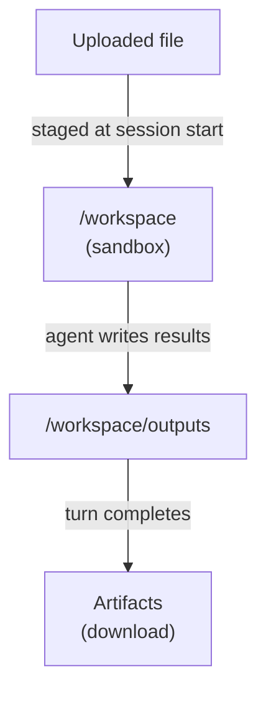

Three different things in Orca hold file content. They are easy to mix up, so here is how they differ:

| | Uploaded file | Workspace file | Artifact |
| --- | --- | --- | --- |
| **What it is** | A file you uploaded to Orca | A file inside a session's sandbox | A saved copy of a file the agent produced |
| **Created by** | You, with `client.files.create` | You (staging) or the agent | Orca, automatically, when a turn completes |
| **Lives** | Until you delete it | As long as the session's sandbox | Until you delete it or its session |
| **Can change** | No | Yes, the agent can edit it | No, it is a snapshot |
| **Use it for** | Inputs you reuse across sessions | The agent's working area | Results you download |



Files and artifacts need a sandbox. Sessions with `environment: {"type": "none"}` have nowhere to put files.

## Upload a file

Examples on this page assume `client` is an `OpenAI` client configured as in the [quickstart](/quickstart).

`client.files.create` stores a file in Orca and returns an ID. Upload once and stage it into as many sessions as you like.

```python
with open("sales.csv", "rb") as f:
    uploaded = client.files.create(file=("sales.csv", f), purpose="user_data")
print(uploaded.id)
```

## Put files in the sandbox

When you create a session, list files under `environment.files`. Each needs a `path` inside `/workspace` and a source:

- `{"type": "file_id", "file_id": ..., "path": ...}` copies an uploaded file.
- `{"type": "inline", "data": <base64>, "path": ...}` sends small content directly.

You can also add files to a running sandbox later; see [execution environments](/guides/environments#add-files-later).

Size limits:

| What | Limit |
| --- | --- |
| An uploaded file (`client.files.create`) | 512 MiB |
| An `inline` file in `environment.files` | 16 MiB |
| Everything staged into one sandbox at session start | 64 MiB |

## Get results back as artifacts

Tell the agent to save its results under **`/workspace/outputs`**. When a turn completes, Orca copies every regular file in that folder (including subfolders) into an artifact. Then list and download them:

```python
from pathlib import Path

agents = client.beta.agents

# 1. Upload the input once.
uploaded = client.files.create(
    file=("input.txt", b"source material"),
    purpose="user_data",
)

# 2. Copy it into a new sandbox.
session = agents.sessions.create(
    agent_id=agent.id,
    environment={
        "type": "openai_hosted",
        "network": {"access": "disabled"},
        "files": [
            {"type": "file_id", "file_id": uploaded.id, "path": "/workspace/input.txt"},
        ],
    },
)

# 3. Ask for a result in /workspace/outputs and read the stream to the end.
prompt = "Read input.txt and write a summary to /workspace/outputs/summary.txt"
with agents.sessions.stream(session.id, input=prompt) as stream:
    for event in stream:
        pass

# 4. Download every artifact as raw bytes.
for artifact in agents.sessions.artifacts.list(session.id):
    content = agents.sessions.artifacts.content(artifact.id, session_id=session.id)
    Path(Path(artifact.path).name).write_bytes(content.content)
```

It assumes an `agent` created as in the quickstart. It uploads a file, stages it, asks the agent for a summary, then saves every artifact to the current folder.

### How capture works

- **Only `/workspace/outputs` is captured.** A file elsewhere in the workspace is not, even if the agent mentions it. For self-hosted environments the folder is `outputs` inside your `workspace_directory`.
- **Only completed turns are captured.** A failed or cancelled turn produces no artifacts.
- **Artifacts never change.** If the agent edits a file in a later turn, that turn gets a new artifact, and the old one keeps the old content.
- **Symbolic links are skipped.**
- **Size limits apply**: 64 MiB per file, 256 MiB and 4,096 entries per capture. If the outputs folder exceeds them, nothing from that turn is captured. The turn itself still completes, so an empty artifact list after a big job can mean this.

## Tips

- **Be explicit in your instructions.** "Write the report to `/workspace/outputs/report.md`" works much better than "create a report".
- **Save bytes, not text.** Artifacts can be images, PDFs, or archives. Write the raw content to disk rather than decoding it as UTF-8.
- **Download before you delete.** Deleting a session deletes its artifacts.
- **Treat outputs as untrusted.** The agent produced them, possibly from untrusted input. Check them before opening or executing them.
- **Keep secrets out of staged files.** Anything in the workspace is visible to the agent and to commands it runs. Use [vaults](/guides/credentials) for credentials.

## Common mistakes

| Symptom | Cause |
| --- | --- |
| The artifact list is empty | The agent saved outside `/workspace/outputs`, the turn did not complete, or the session has no sandbox. |
| An artifact is missing a later change | You are reading an artifact from an earlier turn. Each turn's capture is separate. |
| Staging fails at session creation | The path is outside `/workspace`, or the file ID does not exist or belongs to another account. |

See also: [execution environments](/guides/environments), [skills and templates](/guides/skills) for reusable bundles, [runnable examples](/examples), and the [files reference](/reference/resources#files).
