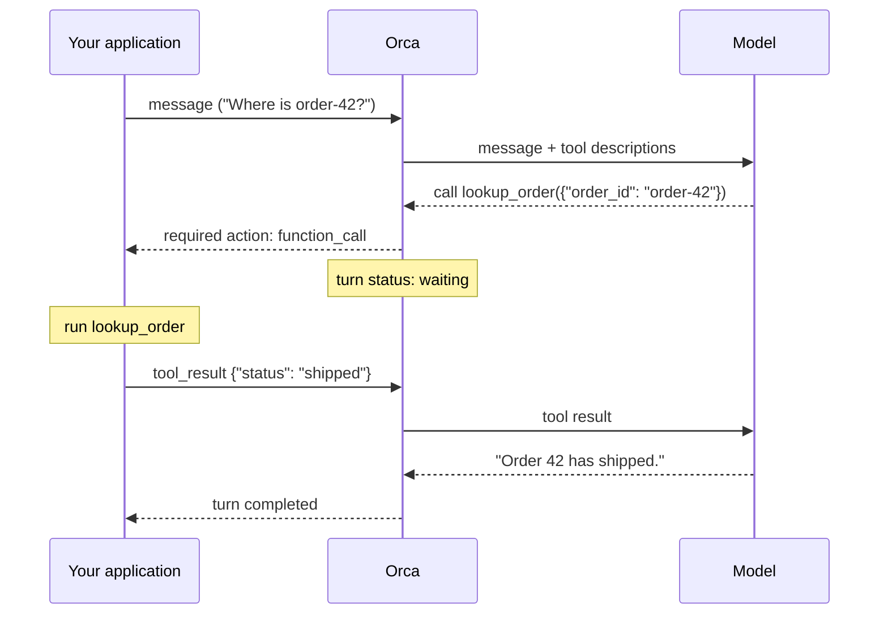

A **function tool** is a function that lives in **your** code. You describe it to the agent (name, purpose, parameters). When the model decides it needs it, Orca pauses the turn and asks your application to run it. Your code runs the function, sends back the result, and the agent continues.

Use function tools when the agent needs your data or your systems: your database, your internal APIs, actions that need your application's permissions. The agent never gets direct access; it can only ask, and your code decides.

## How a function call flows



While Orca waits for your result, the turn's status is `waiting` and the session's status is `requires_action`. Nothing happens until you answer.

## Step 1: describe the tool on the agent

Examples on this page assume `client` is an `OpenAI` client configured as in the [quickstart](/quickstart).

A tool definition has a `name`, a `description` the model reads to decide when to use it, and `parameters` as a JSON Schema. Write the description for the model: say what the tool does and when to use it.

```python
agents = client.beta.agents

lookup_order_tool = {
    "type": "function",
    "name": "lookup_order",
    "description": "Read an order by ID. Use when the user asks about an order.",
    "parameters": {
        "type": "object",
        "properties": {"order_id": {"type": "string"}},
        "required": ["order_id"],
        "additionalProperties": False,
    },
    "defer_loading": False,
}

agent = agents.create(
    model="orca/openrouter/YOUR_OPENROUTER_MODEL_ID",
    name="order-reader",
    tools=[lookup_order_tool],
)
```

## Step 2: answer calls

There are two ways to answer. Pick based on whether the code that sends messages can also run the functions.

### Option A: the stream helper (simplest)

Pass `tool_handlers` to `sessions.stream`. Each handler receives the parsed arguments and returns a JSON-serializable result. The helper sends results back for you while the stream is open, all within the same turn.

```python
def lookup_order(args):
    if args.get("order_id") != "order-42":
        return {"error": "not found"}
    return {"status": "shipped"}


session = agents.sessions.create(agent_id=agent.id, environment={"type": "none"})

with agents.sessions.stream(
    session.id,
    input="Check order-42",
    tool_handlers={"lookup_order": lookup_order},
) as stream:
    for event in stream:
        if event.type == "agent.session.turn.completed":
            print("done")
```

Read the stream to the end, or the helper stops answering calls. If a handler raises an exception, the model is told the tool failed, but your exception message is not shown to it.

### Option B: answer from any process

If calls should be handled somewhere else, such as a worker queue, poll the session for pending calls and post each result as an input event. Here `session_id` is the session to watch and `run_tool` is your own dispatcher.

```python
import json
import time

sessions = client.beta.agents.sessions
answered = set()


def own_turns():
    return [t for t in sessions.turns.list(session_id).data if t.subagent_id is None]


while True:
    for action in sessions.retrieve(session_id).required_actions or []:
        if action.type != "function_call" or action.call_id in answered:
            continue

        args = action.arguments
        if isinstance(args, str):
            args = json.loads(args)
        result = run_tool(action.name, args)  # your code: validate first

        sessions.events.create(
            session_id,
            events=[
                {
                    "type": "agent.session.input.tool_result",
                    "turn_id": action.turn_id,
                    "call_id": action.call_id,
                    "success": True,
                    "output": json.dumps(result),
                }
            ],
        )
        answered.add(action.call_id)

    turns = own_turns()
    if turns and turns[0].status in ("completed", "failed", "cancelled"):
        break
    time.sleep(0.5)
```

A few details matter here:

- **Keep polling until the turn ends.** The model can request several calls at once, and they may appear in `required_actions` one at a time. One snapshot can miss some.
- **Remember which `call_id`s you answered.** If you answer the same call twice, or rerun a function that has side effects, you may do the work twice.
- **Send `"success": False`** with an `"error"` message when the tool could not do its job. The model sees the error and can react, such as by asking the user for a different ID.
- **Answering the same call again with a different result is rejected** (HTTP 409). Resending the identical result is harmless.
- **`arguments` may be a JSON string.** Parse it before use.

## Keep it safe

The model chooses the arguments, and the model can be influenced by anything it reads, including user input and tool output. Treat arguments like any untrusted request:

- Validate every argument against the schema and your business rules.
- Check that the end user is allowed to do what the call asks. The model does not know your permissions.
- Give each tool the narrowest job possible. `lookup_order(order_id)` is safer than `run_sql(query)`.
- Require confirmation in your application for anything destructive or expensive. Instructions such as "never delete" are not a security control.

## Function tools or MCP?

| | Function tools | [MCP tools](/guides/mcp) |
| --- | --- | --- |
| Where the code runs | Your application | A separate MCP server, called by Orca |
| You must be online to answer | Yes. The turn waits for you. | No |
| Good for | Your own data and actions, per-user permissions | Reusable services, third-party integrations |

See also: [turns and statuses](/turn-lifecycle), [runnable examples](/examples) (both answer styles in Python and TypeScript), and the [sessions reference](/reference/sessions).
