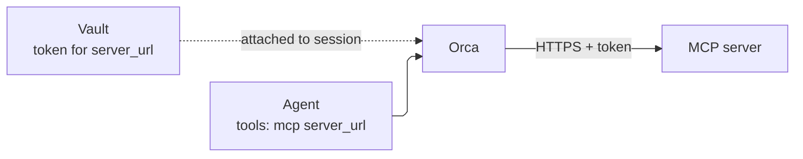

**MCP** (Model Context Protocol) is an open standard for offering tools over HTTP. An **MCP server** is a web service that publishes a list of tools (for example `search_issues`, `lookup_order`) and runs them when asked. Many products ship one, and you can write your own.

When you give an agent an MCP tool, Orca connects to that server, discovers its tools, and lets the model call them. Unlike [function tools](/guides/function-tools), your application does not need to be online to answer: Orca calls the MCP server directly.

<Warning>
Remote MCP servers are currently blocked on hosted Orca. A session whose agent has an `mcp` tool is refused with HTTP 400 on `server_url`: "Destination is not enabled in the server egress policy". If you need a remote MCP server, write to support@okik.io.
</Warning>

## How it fits together



Two pieces work together:

1. **The agent** lists the MCP server's URL and, optionally, which of its tools the model may use.
2. **A vault credential** holds the server's access token, if it needs one. You attach the vault to the session. The token is never shown to the model.

## Before you start

- Remote MCP servers are currently blocked on hosted Orca; see the note above.
- Get a token for the MCP server if it requires authentication. An admin stores it in a vault.

## Example

Examples on this page assume `client` is an `OpenAI` client configured as in the [quickstart](/quickstart).

This creates a vault and credential for the server, an agent that may use one of its tools, and a session that uses both.

```python
import os

agents = client.beta.agents
url = "https://mcp.example.com/orders/mcp"

# 1. Store the server's token in a vault.
vault = agents.vaults.create(name="orders")
agents.vaults.credentials.create(
    vault.id,
    name="orders-reader",
    auth={
        "type": "static_bearer",
        "mcp_server_url": url,
        "token": os.environ["ORDERS_MCP_TOKEN"],
    },
)

# 2. Give the agent the server, limited to one tool.
agent = agents.create(
    model=os.environ["ORCA_MODEL"],
    name="orders",
    tools=[
        {
            "type": "mcp",
            "server_label": "orders",
            "transport": {"type": "http", "server_url": url},
            "allowed_tools": ["lookup_order"],
        }
    ],
)

# 3. Attach the vault to the session that uses the agent.
session = agents.sessions.create(
    agent_id=agent.id,
    environment={"type": "none"},
    vault_ids=[vault.id],
    input="Look up order-42",
)
```

This snippet shows only the wiring. In a real program, [wait for the turn to finish](/turn-lifecycle) before deleting the session.

## The tool definition

| Field | Meaning |
| --- | --- |
| `server_label` | A short name you choose. Tool names appear to the model, and in history, as `mcp__<server_label>__<tool>`, for example `mcp__orders__lookup_order`. |
| `transport.server_url` | The MCP endpoint URL. Must exactly match the credential's `mcp_server_url`. |
| `allowed_tools` | Optional list of tool names the model may call. Leave it out to allow everything the server offers. |
| `connection_origin` | Optional. `service` (default) connects from the Orca server; `environment` connects from the session's sandbox. |

Put tokens in a vault, never in the agent. Orca rejects agents whose MCP `headers` contain `Authorization`, `Cookie`, or similar secret headers.

## What happens at runtime

- **At session start**, Orca connects to each MCP server and fetches its tool list. If a server is unreachable, or a credential it needs is missing, session creation fails with an error instead of starting a broken session.
- **During a turn**, each call is recorded as an `mcp_call` item in the history, with its arguments and result. Use these to audit what the agent did.
- **The calls come from the Orca server** by default, not from your application. To make them from inside the session's sandbox instead, for example to reach a server that only the sandbox's network can see, set `"connection_origin": "environment"` on the tool. That requires a session with a sandbox.

## Keep it safe

- **Allow only what is needed.** Use `allowed_tools`, and prefer read-only tools. Add write tools only when the task requires them.
- **Treat results as untrusted.** An MCP server can return any text, including text that tries to give the model new instructions. Do not give an agent that reads untrusted content access to dangerous tools.
- **Scope credentials tightly.** Each credential works only for its exact server URL. Use tokens with the smallest permissions the server supports.

## Troubleshooting

| Symptom | Check |
| --- | --- |
| Session creation fails with "Destination is not enabled in the server egress policy" | Remote MCP servers are currently blocked on hosted Orca. Write to support@okik.io if you need one. |
| Session creation fails mentioning the MCP URL | The URL is not HTTPS, or the server is unreachable. |
| Session creation fails mentioning a credential | No credential in the attached vaults matches `server_url` exactly (watch for trailing slashes and paths). |
| The model never calls the tool | The tool is missing from `allowed_tools`, or its description does not make clear when to use it. |

See also: [credentials and vaults](/guides/credentials), [runnable MCP examples](/examples), and the [vault reference](/reference/resources#vaults-and-credentials).
