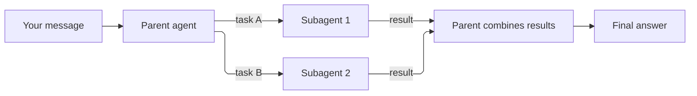

A **subagent** is a helper that an agent starts in the middle of a turn to handle part of the work. The main agent (the *parent*) writes the helper a task, the helper works on it in its own separate conversation, and its result comes back to the parent, which combines everything into one answer.

Use subagents when a task has parts that can be done independently, for example reviewing five files, or researching three competitors. Helpers can work in parallel, and each one starts with a clean context that holds only its own piece of the task.



## What a subagent shares, and what it does not

| | Shared with the parent | Its own |
| --- | --- | --- |
| Model and tools | Yes | |
| Sandbox and files | Yes, the same environment | |
| Conversation history | | Yes. It sees only the task the parent wrote. |
| Turns and items | | Yes, listed under the subagent |

Subagents cannot start subagents of their own. Delegation is one level deep.

## Turn it on

Examples on this page assume `client` is an `OpenAI` client configured as in the [quickstart](/quickstart).

Set `multi_agent` on the agent. `max_concurrent_subagents` limits how many helpers run at once.

```python
import os

agent = client.beta.agents.create(
    model=os.environ["ORCA_MODEL"],
    name="review-lead",
    instructions=(
        "Delegate separate review tasks when useful. Give each child a bounded "
        "task and request evidence. Combine the results and state disagreements."
    ),
    multi_agent={"enabled": True, "max_concurrent_subagents": 2},
)
```

Enabling it lets the agent delegate. It does not force it to: the model decides when delegation helps. Say in the instructions when to delegate and what each helper should return.

Everything else works as usual: create a session, send a message, and wait for the parent's turn to finish. The turn ends only after all its helpers are done.

## See what the helpers did

The parent's history shows its own messages plus the calls it made to start and talk to helpers (`create_subagent_call` items and related types). Each helper's own conversation is stored separately under the session:

```python
sessions = client.beta.agents.sessions
for child in sessions.subagents.list(session_id):
    details = sessions.subagents.retrieve(child.id, session_id=session_id)
    print(details.id, details.status)
    for turn in sessions.subagents.turns.list(child.id, session_id=session_id):
        print("child turn:", turn.id, turn.status)
    for item in sessions.subagents.items.list(child.id, session_id=session_id):
        print("child item:", item.id, item.type)
```

The iterators fetch all pages. For a single helper turn, `sessions.subagents.turns.retrieve(turn_id, session_id=session_id, subagent_id=child.id)` gets its state, and `sessions.subagents.turns.items.list(...)` lists its items. The [sessions reference](/reference/sessions#subagents-and-their-history) has the full route table.

## Watch out for

- **Helper turns appear in the session's turn list.** They have a `subagent_id`. When you wait for your own turn to finish, skip them, or you may stop waiting too early. See [turns and statuses](/turn-lifecycle#subagent-turns-appear-in-the-same-list).
- **A closed helper is not a successful helper.** The `agent.session.subagent.closed` event means the helper stopped. Check its turns to see whether it completed or failed.
- **Cost and time.** Every helper makes its own model calls. Delegation can finish sooner but usually uses more tokens.
- **Same trust level.** A helper has the same tools and sandbox as its parent. Delegation is not a security boundary.
- **Keep the session** until you have read the helper histories and downloaded any [artifacts](/guides/files-and-artifacts) you need.

See also: [sessions and turns](/guides/sessions), and [events](/reference/events) for the `agent.session.subagent.*` events.
