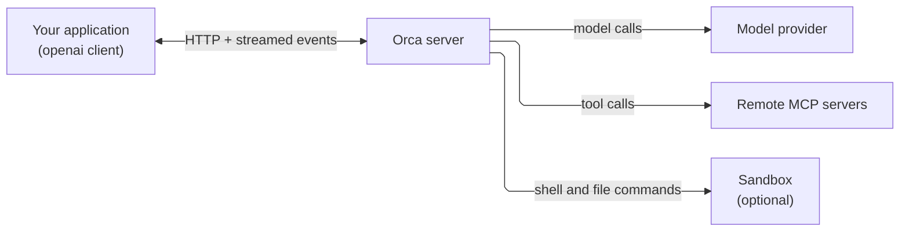

## What is Orca?

Orca is a server that runs AI agents for your application. You send it a task, and it runs the agent: it calls the model, runs tools, executes code in a sandbox, keeps the conversation history, and streams progress back. Your application only makes HTTP requests.

You talk to Orca with the **official OpenAI client libraries** (`openai` for Python or TypeScript). Orca implements the OpenAI Agents API, so you point the client at your Orca URL instead of OpenAI's. There is no Orca SDK to install.

```python
from openai import OpenAI

client = OpenAI(
    base_url="https://YOUR_ORCA_HOST/v1",  # your Orca endpoint, not api.openai.com
    api_key="YOUR_ORCA_KEY",               # an Orca key, not an OpenAI key
)
agents = client.beta.agents                # the Agents API lives under beta.agents
```

## What happens when you run an agent



1. You create an **agent**: a saved configuration of model, instructions, and tools.
2. You open a **session** for that agent. A session is one conversation. It can have a **sandbox** attached, a private machine where the agent can run commands and edit files.
3. You send a message. Orca starts a **turn**: it calls the model, runs any tools the model asks for, and repeats until the model gives a final answer.
4. You watch the turn as it happens through streamed **events**, or wait for it to finish and read the saved history.
5. Files the agent writes to its outputs folder come back to you as downloadable **artifacts**.

Orca stores all of this durably. If your application disconnects or restarts, the session, its history, and any running turn are still on the server.

[How Orca works](/concepts) explains each of these parts in more detail.

## What you need

- **An Orca endpoint URL** ending in `/v1`, such as `https://orca.example.com/v1`.
- **An Orca API key.** It identifies your account (your *tenant*) on that endpoint. It is not an OpenAI key.
- **A model name** that the endpoint offers, or your own provider key (see [models and provider keys](/providers)).

Whoever runs your Orca deployment can give you all three.

## Where to go next

<CardGroup cols={2}>
  <Card title="Run your first agent" icon="terminal" href="/quickstart">Create an agent, send a message, and read the reply in a few minutes.</Card>
  <Card title="How Orca works" icon="diagram-project" href="/concepts">Agents, sessions, turns, sandboxes, and how they fit together.</Card>
  <Card title="Turns and statuses" icon="arrows-spin" href="/turn-lifecycle">What each status means and how to tell when work is done.</Card>
  <Card title="Glossary" icon="book" href="/glossary">Short definitions of every term these docs use.</Card>
</CardGroup>

## Choose what your agent can do

| You want the agent to... | Use | Guide |
| --- | --- | --- |
| Just talk | No sandbox: `environment={"type": "none"}` | [Sessions and turns](/guides/sessions) |
| Call functions in your own code | Function tools | [Function tools](/guides/function-tools) |
| Use a third-party service | Remote MCP tools | [MCP tools](/guides/mcp) |
| Run code and work with files | A sandbox | [Execution environments](/guides/environments) |
| Produce files you can download | Artifacts | [Files and artifacts](/guides/files-and-artifacts) |
| Follow a reusable procedure | Skills | [Skills and templates](/guides/skills) |
| Split work across helpers | Subagents | [Subagents](/guides/subagents) |

## How these docs relate to OpenAI's

The [OpenAI Agent API quickstart](https://developers.openai.com/api/docs/guides/agents-api/quickstart/) describes the same API from OpenAI's side and is useful background. These docs describe what Orca supports and how it behaves.

<Note>
Orca is a separate service, not an OpenAI endpoint. Your Orca key works only with Orca, and an OpenAI key does not work with Orca. OpenAI's docs may describe features or defaults that your Orca deployment does not have. Check the [compatibility notes](/reference/overview#compatibility) before you copy an example from OpenAI's docs.
</Note>
