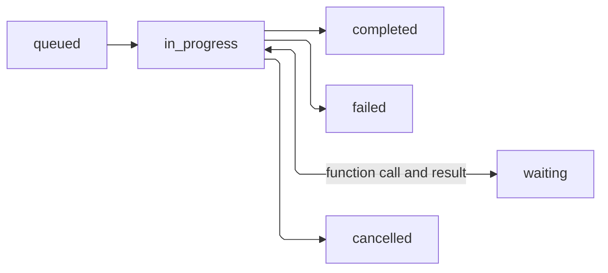

Orca runs agents in the background. When you send a message, the request returns as soon as Orca has **accepted** it, often before the model has produced a word. Your application then has to find out when the work is **finished** and whether it succeeded. This page explains how.

## The short version

1. Send a message (when you create a session, or later with `sessions.events.create`).
2. Wait until the newest turn has status `completed`, `failed`, or `cancelled`.
3. If the session shows `requires_action`, do what it asks, then keep waiting.
4. Read the result from the session's items, and its files from artifacts.

There are two ways to wait:

| Approach | How | Good for |
| --- | --- | --- |
| **Stream** | `sessions.stream(...)` or `sessions.events.stream(...)` and watch for `agent.session.turn.completed`, `.failed`, or `.cancelled` | Showing progress live in a UI |
| **Poll** | Call `sessions.turns.list(session_id)` every second or so and check the newest turn's `status` | Background jobs, scripts, and recovery after a restart |

Both see the same stored state. You can switch between them at any time.

## Turn statuses

A turn moves through these statuses. The diagram shows the usual path; a turn can also fail or be cancelled from `queued` or `waiting`, for example if the sandbox cannot start or the server restarts. Once a turn reaches a terminal status it never changes again.



| Status | Meaning |
| --- | --- |
| `queued` | Accepted, not started yet. |
| `in_progress` | The agent is working: calling the model or running tools. |
| `waiting` | The agent called one of your [function tools](/guides/function-tools) and is waiting for your application to send the result. |
| `completed` | The agent produced its final answer. |
| `failed` | The turn stopped because of an error. The turn's `error` field says why. |
| `cancelled` | You cancelled it. |

`completed`, `failed`, and `cancelled` are **terminal**: the turn is over. Its `usage` field then shows the tokens it used.

<Warning>
`completed` means the agent finished, not that the task succeeded. A tool call can fail inside a completed turn, and the model can report that it could not do what you asked. Check the items or artifacts for the actual result.
</Warning>

## Session statuses

The session has its own status. It summarizes what the session is doing right now.

| Status | Meaning | What to do |
| --- | --- | --- |
| `idle` | No turn is running. The last one ended (or there has not been one yet). | Send the next message when you are ready. |
| `in_progress` | A turn is running. | Wait. |
| `requires_action` | The session is waiting for **you**. See `required_actions`. | Do what it asks; see below. |
| `failed` | The most recent turn failed. `session.error` has the message. | Inspect the failure. You can still send another message; it starts a new turn. |

<Note>
`idle` does not mean your request succeeded. It only means nothing is running. Always check the turn's own status.
</Note>

## When the session needs you

When the agent cannot continue without your application, the session status becomes `requires_action` and `session.required_actions` lists what it needs. There are two kinds.

| `type` | What happened | What to do |
| --- | --- | --- |
| `function_call` | The model called one of your [function tools](/guides/function-tools). The entry includes `turn_id`, `call_id`, `name`, and `arguments`. | Run the function in your code and send back an `agent.session.input.tool_result` event with the same `turn_id` and `call_id`. |
| `environment_connection` | A [self-hosted environment](/guides/environments#self-hosted-environment) is not connected yet, or has disconnected. | Start or restart your executor. Input you sent is held until it connects. |

If you use the Python or TypeScript `sessions.stream(..., tool_handlers=...)` helper, it answers function calls for you while the stream is open.

## Sending a message while a turn is running

If a turn is already running when you send a message, Orca does **not** start a second turn. It adds your message to the running turn, and the agent sees it at its next step. This is useful for steering the agent mid-task ("actually, skip the tests").

If no turn is running, the message starts a new turn.

This affects how you wait for the result:

- **If the previous turn had already ended** when you sent the follow-up, a new turn starts. Remember the previous turn's ID and wait for a turn with a **different** ID to reach a terminal status; otherwise you will see the old, already-finished turn and stop too early. The [quickstart](/quickstart) does this.
- **If a turn was still running**, your message joined it. Wait for that same turn to end. No new turn appears.

## Subagent turns appear in the same list

If your agent uses [subagents](/guides/subagents), their turns also appear in `sessions.turns.list(session_id)`, marked with a non-null `subagent_id`. A subagent usually finishes before the turn that started it. When you are waiting for **your** turn, skip turns that have a `subagent_id`:

```python
turns = [t for t in sessions.turns.list(session_id).data if t.subagent_id is None]
newest = turns[0] if turns else None
```

## Things that do not stop a turn

- **Closing a stream.** Disconnecting only stops you from watching. The turn keeps running on the server.
- **A client timeout.** Your HTTP library giving up does not cancel anything on the server.
- **Your application restarting.** The session and its turn are stored on the server.

To stop a turn, send a cancel event:

```python
sessions.events.create(session_id, events=[{"type": "agent.session.input.cancel"}])
```

If the Orca server itself restarts while a turn is running, that turn is marked `failed`. Orca does not re-run it, because the agent may already have done things in the outside world (sent an email, changed a record) that should not happen twice. You can send a new message to continue the conversation.

## Environment statuses

Sessions with a sandbox also have an environment. Read its current status with `agents.environments.retrieve(session.environment.id)`.

| Status | Meaning |
| --- | --- |
| `pending` | Being created, restored, or (for self-hosted) waiting for your executor to connect. |
| `connected` | Ready. Turns can use it. |
| `failed` | The sandbox could not be created, or a self-hosted executor failed to register. Create a new session. |
| `disconnected` | Not currently reachable. A managed sandbox that has been idle for a while is paused to save resources and shows this status; it resumes automatically the next time it is used. A self-hosted executor that dropped its connection shows this until it reconnects. |

<Note>
When a paused managed sandbox resumes, files in the workspace are restored, but running processes (such as a dev server the agent started) are not. Ask the agent to start them again if needed.
</Note>

## A complete wait loop

This loop waits for a new turn to finish (pass the previous turn's ID if this is a follow-up sent after that turn ended), reports anything that needs attention, and stops after five minutes instead of waiting forever:

```python
import time

def wait_for_turn(sessions, session_id, previous_turn_id=None, timeout=300):
    deadline = time.monotonic() + timeout
    while time.monotonic() < deadline:
        turns = [t for t in sessions.turns.list(session_id).data if t.subagent_id is None]
        newest = turns[0] if turns else None
        if (newest and newest.id != previous_turn_id
                and newest.status in ("completed", "failed", "cancelled")):
            return newest
        session = sessions.retrieve(session_id)
        if session.required_actions:
            print("waiting on:", [a.type for a in session.required_actions])
        time.sleep(1)
    # Timing out here does not cancel the turn. Check again before resending.
    raise TimeoutError("Turn still running; check the session before retrying")
```

For retry and recovery patterns, see [reliable session workflows](/guides/reliability).
